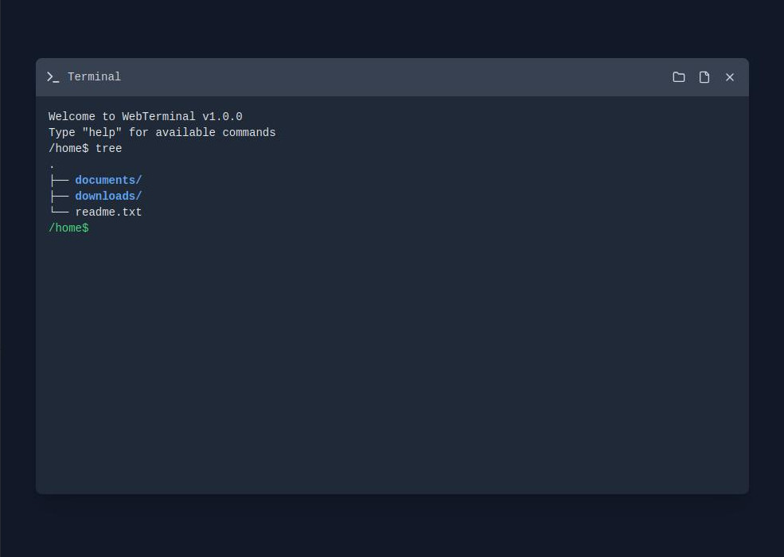

# Terminal-Emulator

https://terminal-emulator-ten.vercel.app/




# Terminal Emulator

Welcome to the Terminal Emulator project! This application provides a web-based terminal interface, allowing users to execute commands and interact with a simulated shell environment directly from their browser.

## Features

- **Web-Based Interface**: Access the terminal emulator through any modern web browser without the need for additional software installations.
- **Command Execution**: Execute a variety of shell commands within the emulator to simulate a real terminal experience.
- **Responsive Design**: Enjoy a user-friendly interface that adapts seamlessly to different screen sizes and devices.

## Technologies Used

- **TypeScript**: Ensures type safety and enhances code maintainability.
- **React**: Facilitates the creation of dynamic and responsive user interfaces.
- **Vite**: Provides fast and efficient build tooling for modern web projects.
- **Tailwind CSS**: Offers utility-first CSS for rapid UI development.

## Getting Started

To set up the project locally, follow these steps:

1. **Clone the Repository**:

   ```bash
   git clone https://github.com/IgnatMaldive/Terminal-Emulator.git
   ```

2. **Navigate to the Project Directory**:

   ```bash
   cd Terminal-Emulator
   ```

3. **Install Dependencies**:

   ```bash
   npm install
   ```

4. **Start the Development Server**:

   ```bash
   npm run dev
   ```

The application should now be running locally. Open your browser and navigate to the provided local development URL to access the terminal emulator.

## Contributing

Contributions are welcome! If you have suggestions for improvements or new features, please open an issue or submit a pull request.

## License

This project is licensed under the MIT License. See the [LICENSE](LICENSE) file for more details.

## Acknowledgments

Special thanks to all contributors and the open-source community for their invaluable support and resources.

---

For more information, visit the [GitHub repository](https://github.com/IgnatMaldive/Terminal-Emulator). 